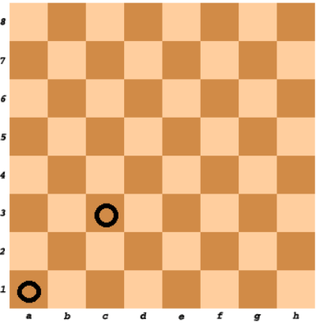

### No.29 chess Board Cell Color
Given two cells on the standard chess board, determine whether they have the same color or not.

Example

    For cell1 = "A1" and cell2 = "C3", the output should be
    chessBoardCellColor(cell1, cell2) = true.  

  

For cell1 = "A1" and cell2 = "H3", the output should be
chessBoardCellColor(cell1, cell2) = false.  

  

Input/Output

    [execution time limit] 4 seconds (py3)

    [input] string cell1

    Guaranteed constraints:
    cell1.length = 2,
    'A' ≤ cell1[0] ≤ 'H',
    1 ≤ cell1[1] ≤ 8.

    [input] string cell2

    Guaranteed constraints:
    cell2.length = 2,
    'A' ≤ cell2[0] ≤ 'H',
    1 ≤ cell2[1] ≤ 8.

    [output] boolean
        true if both cells have the same color, false otherwise.
#### python
```python
def chessBoardCellColor(cell1, cell2):
    arr = {'A': 1, 'B': 2, 'C': 3, 'D': 4, 'E': 5, 'F': 6, 'G': 7, 'H': 8}
    if (arr[cell1[0]] + int(cell1[1]) + 1) % 2 == (arr[cell2[0]] + int(cell2[1]) + 1) % 2:
        return True
            
    return False
```
```python
def chessBoardCellColor(cell1, cell2):
    return (ord(cell1[0])+int(cell1[1])+ord(cell2[0])+int(cell2[1]))%2==0
```