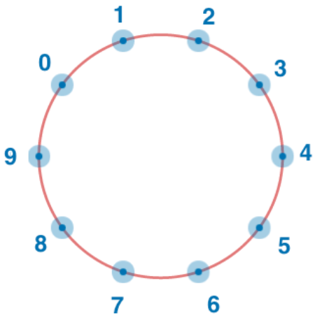

### No.30 Cirle of Numbers
Consider integer numbers from 0 to n - 1 written down along the circle in such a way that the distance between any two neighboring numbers is equal (note that 0 and n - 1 are neighboring, too).

Given n and firstNumber, find the number which is written in the radially opposite position to firstNumber.

Example

For n = 10 and firstNumber = 2, the output should be
circleOfNumbers(n, firstNumber) = 7.  

  

Input/Output

    [execution time limit] 4 seconds (py3)

    [input] integer n

    A positive even integer.

    Guaranteed constraints:
    4 ≤ n ≤ 20.

    [input] integer firstNumber

    Guaranteed constraints:
    0 ≤ firstNumber ≤ n - 1.

    [output] integer
#### python
```python
def circleOfNumbers(n, firstNumber):
    return (n // 2 + firstNumber) % n
```