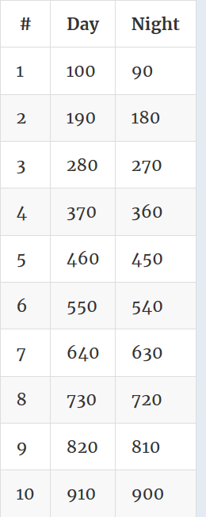

### No.38 growingPlant
Caring for a plant can be hard work, but since you tend to it regularly, you have a plant that grows consistently. Each day, its height increases by a fixed amount represented by the integer upSpeed. But due to lack of sunlight, the plant decreases in height every night, by an amount represented by downSpeed.

Since you grew the plant from a seed, it started at height 0 initially. Given an integer desiredHeight, your task is to find how many days it'll take for the plant to reach this height.

Example

For upSpeed = 100, downSpeed = 10, and desiredHeight = 910, the output should be
growingPlant(upSpeed, downSpeed, desiredHeight) = 10.  

  

The plant first reaches a height of 910 on day 10.

Input/Output

    [execution time limit] 4 seconds (py3)

    [input] integer upSpeed

    A positive integer representing the daily growth of the plant.

    Guaranteed constraints:
    3 ≤ upSpeed ≤ 100.

    [input] integer downSpeed

    A positive integer representing the nightly decline of the plant.

    Guaranteed constraints:
    2 ≤ downSpeed < upSpeed.

    [input] integer desiredHeight

    A positive integer representing the goal height.

    Guaranteed constraints:
    4 ≤ desiredHeight ≤ 1000.

    [output] integer
        The number of days that it will take for the plant to reach / pass desiredHeight.
#### python
```python
def growingPlant(upSpeed, downSpeed, desiredHeight):
    result = 0
    num = 0
    while True:
        num += 1
        result = result + upSpeed
        if result >= desiredHeight:
            return num
        else:
            result = result - downSpeed
```
```python
def growingPlant(upSpeed, downSpeed, desiredHeight):
    if desiredHeight <= upSpeed:
        return 1
    return math.ceil((desiredHeight - upSpeed) / (upSpeed - downSpeed) + 1)
```