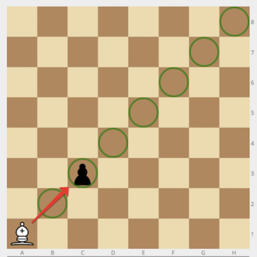
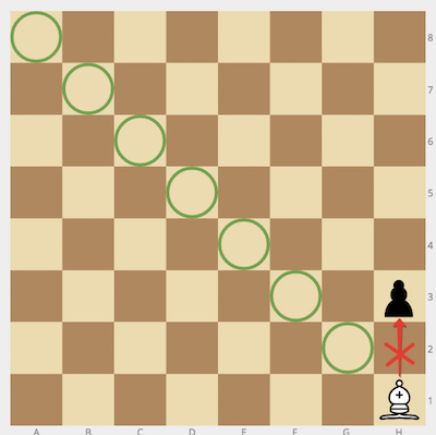

### No.42 Bishop and Pawn
Given the positions of a white bishop and a black pawn on the standard chess board, determine whether the bishop can capture the pawn in one move.

The bishop has no restrictions in distance for each move, but is limited to diagonal movement. Check out the example below to see how it can move:  

  

Example

    For bishop = "a1" and pawn = "c3", the output should be
    bishopAndPawn(bishop, pawn) = true.  

  

Input/Output

    [execution time limit] 4 seconds (py3)

    [input] string bishop

    Coordinates of the white bishop in the chess notation.

    Guaranteed constraints:
    bishop.length = 2,
    'a' ≤ bishop[0] ≤ 'h',
    1 ≤ bishop[1] ≤ 8.

    [input] string pawn

    Coordinates of the black pawn in the same notation.

    Guaranteed constraints:
    pawn.length = 2,
    'a' ≤ pawn[0] ≤ 'h',
    1 ≤ pawn[1] ≤ 8.

    [output] boolean
        true if the bishop can capture the pawn, false otherwise.
#### python
```python
def bishopAndPawn(bishop, pawn):
    bishop_col = bishop[0]
    bishop_row = int(bishop[1])
    pawn_col = pawn[0]
    pawn_row = int(pawn[1])
    if abs(ord(pawn_col) - ord(bishop_col)) == abs(pawn_row - bishop_row):
        return True
    return False
```