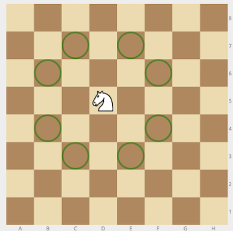
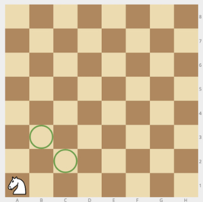
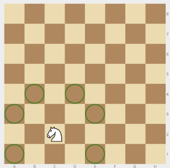

### No.50 chessKnight
Given a position of a knight on the standard chessboard, find the number of different moves the knight can perform.

The knight can move to a square that is two squares horizontally and one square vertically, or two squares vertically and one square horizontally away from it. The complete move therefore looks like the letter L. Check out the image below to see all valid moves for a knight piece that is placed on one of the central squares.  

  

Example

    For cell = "a1", the output should be
    chessKnight(cell) = 2.  

  

For cell = "c2", the output should be
chessKnight(cell) = 6.  

   

Input/Output

    [execution time limit] 4 seconds (py3)

    [input] string cell

    String consisting of 2 letters - coordinates of the knight on an 8 × 8 chessboard in chess notation.

    Guaranteed constraints:
    cell.length = 2,
    'a' ≤ cell[0] ≤ 'h',
    1 ≤ cell[1] ≤ 8.

    [output] integer
#### python
```python
def chessKnight(cell):
    result = 0
    print(chr(ord(cell[0]) + 1))
    if int(cell[1]) + 2 < 9 and chr(ord(cell[0]) + 1) <= 'H':
        result += 1
        print('1')
    if int(cell[1]) + 2 < 9 and chr(ord(cell[0]) - 1) >= 'A':
        result += 1
        print('2')
    if int(cell[1]) - 2 >0 and chr(ord(cell[0]) + 1) <= 'H':
        result += 1
        print('3')
    if int(cell[1]) - 2 >0 and chr(ord(cell[0]) - 1) >= 'A':
        result += 1
        print('4')
    if int(cell[1]) + 1 < 9 and chr(ord(cell[0]) + 2) <= 'H':
        result += 1
        print('5')
    if int(cell[1]) + 1 < 9 and chr(ord(cell[0]) - 2) >= 'A':
        result += 1
        print('6')
    if int(cell[1]) - 1 >0 and chr(ord(cell[0]) + 2) <= 'H':
        result += 1
        print('7')
    if int(cell[1]) - 1 >0 and chr(ord(cell[0]) - 2) >= 'A':
        result += 1
        print('8')
        
    return result
```
