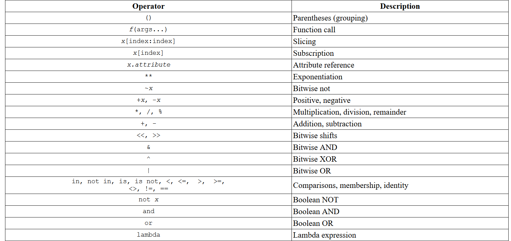

### No.01 Collections Truthness
  

  

```python
xs=[()]
xs[0] # result is ()
type(xs[0]) # result is tuple
```
```python
# result is [True, False]
xs=[()]
res=[False]*2
if xs:
    res[0]=True
if xs[0]:
    res[1]=True
print(res)
```
### No.02 Efficient Comparison
  

  

### No.03 Special Conditional
  

  

  

### No.04 Language Differences
  

  
```python
15//(-4) # result is -4
```
### No.05 Count Bits
Implement the missing code, denoted by ellipses. You may not modify the pre-existing code.

Implement a function that, given an integer n, uses a specific method on it and returns the number of bits in its binary representation.

Note: in this task and most of the following tasks you will be given a code snippet with some part of it replaced by the ellipsis (...). Only this part is allowed to be changed.

Example
For n = 50, the output should be
countBits(n) = 6.

5010 = 1100102, a number that consists of 6 digits. Thus, the output should be 6.

Input/Output

    [execution time limit] 4 seconds (py)

    [input] integer n

    A positive integer.

    Guaranteed constraints:
    1 ≤ n ≤ 109.

    [output] integer
        The number of bits in binary representation of n.
```python
def countBits(n):
    return n.bit_length()
```