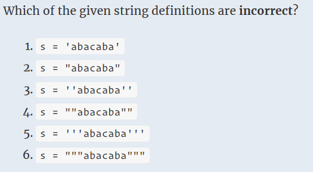
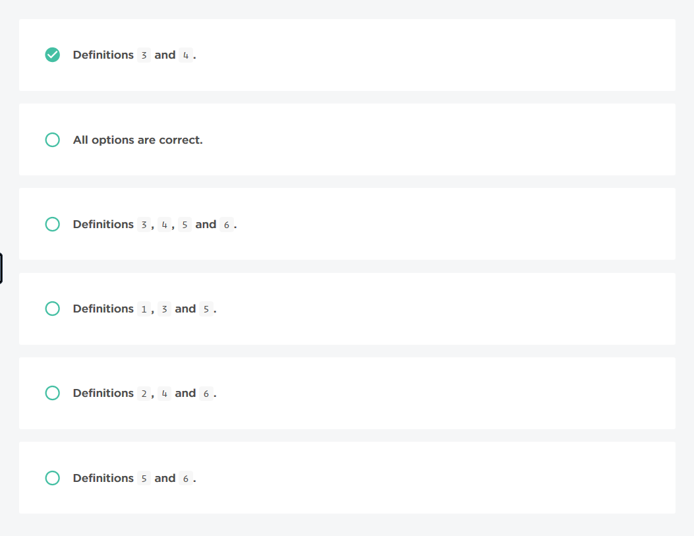

### No.11 String Definition
  

  
### No.12 Fix Message
Implement the missing code, denoted by ellipses. You may not modify the pre-existing code.

One of your friends has an awful writing style: he almost never starts a message with a capital letter, but adds uppercase letters in random places throughout the message. It makes chatting with him very difficult for you, so you decided to write a plugin that will change each message received from your friend into a more readable form.

Implement a function that will change the very first symbol of the given message to uppercase, and make all the other letters lowercase.

Example

For message = "you'll NEVER believe what that 'FrIeNd' of mine did!!1",
the output should be
fixMessage(message) = "You'll never believe what that 'friend' of mine did!!1".

Input/Output

    [execution time limit] 4 seconds (py)

    [input] string message

    A string consisting of English letters, whitespace characters, digits and punctuation marks.

    Guaranteed constraints:
    1 ≤ message.length ≤ 65.

    [output] string
        Fixed message with its first letter capitalized, and all other letters converted to lowercase.
```python
def fixMessage(message):
    return message.capitalize()
```
```python
def fixMessage(message):
    return message[0].upper() + message[1:].lower()
```
### No.13 Cat Walk
Implement the missing code, denoted by ellipses. You may not modify the pre-existing code.

You've been working on a particularly difficult algorithm all day, and finally decided to take a break and drink some coffee. To your horror, when you returned you found out that your cat decided to take a walk on the keyboard in your absence, and pressed a key or two. Your computer doesn't react to letters being pressed when an unauthorized action appears, but allows typing whitespace characters and moving the arrow keys, so now your masterpiece contains way too many whitespace characters.

To repair the damage, you need to start with implementing a function that will replace all multiple space characters in the given line of your code with single ones. In addition, all leading and trailing whitespaces should be removed.

Example

For

line = "def      m   e  gaDifficu     ltFun        ction(x):"

the output should be
catWalk(line) = "def m e gaDifficu ltFun ction(x):".

Input/Output

    [execution time limit] 4 seconds (py)

    [input] string line

    One line from your code containing way too many whitespace characters.

    Guaranteed constraints:
    5 ≤ line.length ≤ 125.

    [output] string
        line with unnecessary whitespace characters removed.
```python
def catWalk(code):
    return ' '.join(code.split())
```
### No.14 Convert Tabs
Implement the missing code, denoted by ellipses. You may not modify the pre-existing code.

You found an awesome customizable Python IDE that has almost everything you'd like to see in your working environment. However, after a couple days of coding you discover that there is one important feature that this IDE lacks: it cannot convert tabs to spaces. Luckily, the IDE is easily customizable, so you decide to write a plugin that would convert all tabs in the code into the given number of whitespace characters.

Implement a function that, given a piece of code and a positive integer x will turn each tabulation character in code into x whitespace characters.

Example

For code = "\treturn False" and x = 4, the output should be

convertTabs(code, x) = "    return False"

Input/Output

    [execution time limit] 4 seconds (py)

    [input] string code

    Your piece of code.

    Guaranteed constraints:
    0 ≤ code.length ≤ 1500.

    [input] integer x

    The number of whitespace characters (' ') that should replace each occurrence of the tabulation character ('\t').

    Guaranteed constraints:
    1 ≤ x ≤ 16.

    [output] string
        The given code with tabulation characters expanded according to x.
```python
def convertTabs(code, x):
    return code.replace('\t', ' '*x)
```
### No.15 Feedback Review
Implement the missing code, denoted by ellipses. You may not modify the pre-existing code.

You've launched a revolutionary service not long ago, and were busy improving it for the last couple of months. When you finally decided that the service is perfect, you remembered that you created a feedbacks page long time ago, which you never checked out since then. Now that you have nothing left to do, you would like to have a look at what the community thinks of your service.

Unfortunately it looks like the feedbacks page is far from perfect: each feedback is displayed as a one-line string, and if it's too long there's no way to see what it is about. Naturally, this horrible bug should be fixed. Implement a function that, given a feedback and the size of the screen, splits the feedback into lines so that:

    each token (i.e. sequence of non-whitespace characters) belongs to one of the lines entirely;
    each line is at most size characters long;
    no line has trailing or leading spaces;
    each line should have the maximum possible length, assuming that all lines before it were also the longest possible.

Example

For feedback = "This is an example feedback" and size = 8,
the output should be

feedbackReview(feedback, size) = ["This is", 
                                  "an", 
                                  "example", 
                                  "feedback"]

Input/Output

    [execution time limit] 4 seconds (py)

    [input] string feedback

    A string containing a feedback. Each feedback is guaranteed to contain only letters, punctuation marks and whitespace characters (' ').

    Guaranteed constraints:
    0 ≤ feedback.length ≤ 100.

    [input] integer size

    The size of the screen. It is guaranteed that it is not smaller than the longest token in the feedback.

    Guaranteed constraints:
    1 ≤ size ≤ 100.

    [output] array.string
        Lines from the feedback, split as described above.
```python
import textwrap
def feedbackReview(feedback, size):
    return textwrap.TextWrapper(width=size).wrap(text=feedback)
```