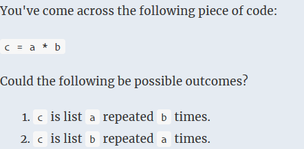
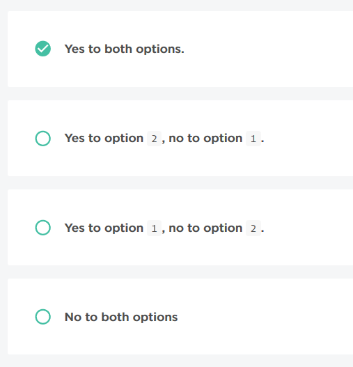

### No.21 List Multiplication
  

  
### No.22 List Concatenation
There is a bug in one line of the code. Find it, fix it, and submit.

Given two lists lst1 and lst2, your task is to return a list formed by the elements of lst1 followed by the elements of lst2.

Note: this is a bugfix task, which means that the function is already implemented but there is a bug in one of its lines. Your task is to find and fix it.

Example

For lst1 = [2, 2, 1] and lst2 = [10, 11], the output should be
listsConcatenation(lst1, lst2) = [2, 2, 1, 10, 11].

Input/Output

    [execution time limit] 4 seconds (py3)

    [input] array.integer lst1

    Guaranteed constraints:
    0 ≤ lst1.length ≤ 20,
    -106 ≤ lst1[i] ≤ 106.

    [input] array.integer lst2

    Guaranteed constraints:
    0 ≤ lst2.length ≤ 20,
    -106 ≤ lst2[i] ≤ 106.

    [output] array.integer
```python
def listsConcatenation(lst1, lst2):
    res = lst1
    res.extend(lst2)
    return res
```
```python
def listsConcatenation(lst1, lst2):
    res = lst1
    res += lst2
    return res
```
### No.23 Two Teams
Implement the missing code, denoted by ellipses. You may not modify the pre-existing code.

There are some students standing in a row, each has some number written on their back. The students are about to divide into two teams by counting off by twos: those standing at the even positions (0-based) will go to team A, and those standing at the odd position will join the team B.

Your task is to calculate the difference between the sums of numbers written on the backs of the students that will join team A, and those written on the backs of the students that will join team B.

Example

For students = [1, 11, 13, 6, 14], the output should be
twoTeams(students) = 11.

Students with numbers 1, 13 and 14 will join team A, and students with numbers 11 and 6 will join team B. Thus, the answer is (1 + 13 + 14) - (11 + 6) = 11.

Input/Output

    [execution time limit] 4 seconds (py3)

    [input] array.integer students

    Array of numbers written on the students' backs.

    Guaranteed constraints:
    2 ≤ students.length ≤ 50,
    1 ≤ students[i] ≤ 99.

    [output] integer
```python
def twoTeams(students):
    return sum(students[::2])-sum(students[1::2])
```
### No.24 Remove Tasks
Implement the missing code, denoted by ellipses. You may not modify the pre-existing code.

Today is a good day: it's the kth year since you started to work at the company, which means you have to have a party today. In order to get home earlier and prepare for the jamboree, you need to get home early. You decided to remove each kth tasks from your toDo list, since today is your day and you can do whatever you please.

Given the list of task ids in your toDo list, remove each kth task from it and return the list of remaining tasks.

Example

For k = 3 and toDo = [1237, 2847, 27485, 2947, 1, 247, 374827, 22],
the output should be
removeTasks(k, toDo) = [1237, 2847, 2947, 1, 374827, 22].

Input/Output

    [execution time limit] 4 seconds (py3)

    [input] integer k

    Guaranteed constraints:
    1 ≤ k ≤ 30.

    [input] array.integer toDo

    Ids of the tasks in your to-do list.

    Guaranteed constraints:
    1 ≤ toDo.length ≤ 100,
    1 ≤ toDo[i] ≤ 4 · 105.

    [output] array.integer
```python
def removeTasks(k, toDo):
    del toDo[k-1::k]
    return toDo
```
### No.25 Print List
Implement the missing code, denoted by ellipses. You may not modify the pre-existing code.

You were supposed to prepare a presentation about lists in Python, but totally forgot about it. Now that you don't have enough time for it, you decide to show some usage examples instead and say with the poker face that this is how you understood the assignment.

Now you need to implement a function that will display a list in the console. Implement a function that, given a list lst, will return it as a string as follows: "This is your list: lst".

Example

For lst = [1, 2, 3, 4, 5], the output should be
printList(lst) = "This is your list: [1, 2, 3, 4, 5]".

Input/Output

    [execution time limit] 4 seconds (py3)

    [input] array.integer lst

    A list containing integer values.

    Guaranteed constraints:
    0 ≤ lst.length ≤ 50,
    -100 ≤ lst[i] ≤ 100.

    [output] string
        A string containing information about lst.
```python
def printList(lst):
    return "This is your list: [{0}]".format(', '.join(str(v) for v in lst))
```
```python
def printList(lst):
    return f'This is your list: {lst}'
```
```python
def printList(lst):
    return "This is your list: " + str(lst)
```
