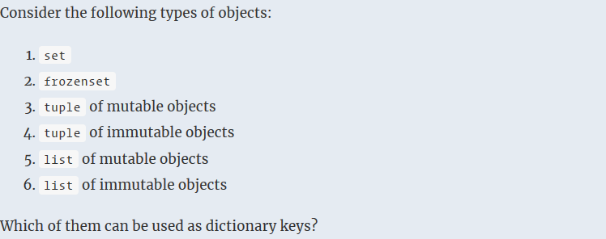
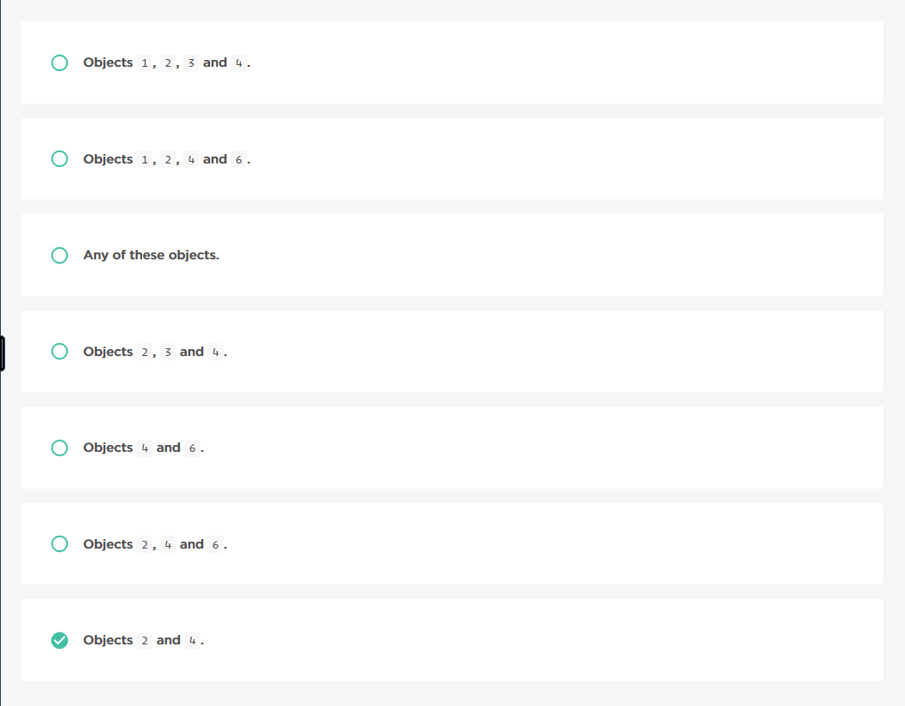
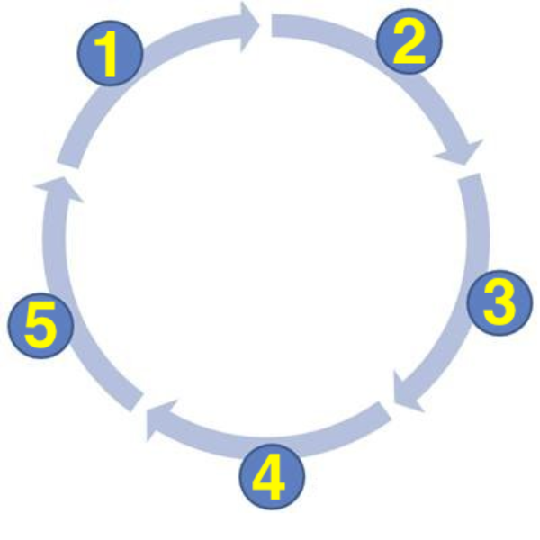

### No.40 Dictionary Keys




### No.41 Unique Characters
Implement the missing code, denoted by ellipses. You may not modify the pre-existing code.

You need to compress a large document that consists of a small number of different characters. To choose the best encoding algorithm, you would like to look closely at the characters that comprise this document.

Given a document, return an array of all unique characters that appear in it sorted by their ASCII codes.

Example

For document = "Todd told Tom to trot to the timber",
the output should be
uniqueCharacters(document) = [' ', 'T', 'b', 'd', 'e', 'h', 'i', 'l', 'm', 'o', 'r', 't'].

Input/Output

    [execution time limit] 4 seconds (py3)

    [input] string document

    A string consisting of English letters, whitespace characters and punctuation marks.

    Guaranteed constraints:
    1 ≤ document.length ≤ 80.

    [output] array.char
        A sorted array of all the unique characters that appear in the document.

```python
def uniqueCharacters(document):
    return sorted(list(set(document)))
```
### No.42 Implement the missing code, denoted by ellipses. You may not modify the pre-existing code.

For the upcoming academic year the Coolcoders University should decide which students will get the scholarships. Scholarships are considered to be correctly distributed if all best students have it, but not all students in the university do. Obviously, only university students should be able to get a scholarship, i.e. there should be no outsiders in the list of the students that will get a scholarships.

You are given lists of unique student ids bestStudents, scholarships and allStudents, representing ids of the best students, students that will get a scholarship and all the students in the university, respectively. Return true if the scholarships are correctly distributed and false otherwise.

Example

    For bestStudents = [3, 5], scholarships = [3, 5, 7], and
    allStudents = [1, 2, 3, 4, 5, 6, 7], the output should be
    correctScholarships(bestStudents, scholarships, allStudents) = true;

    For bestStudents = [3, 5], scholarships = [3, 5], and
    allStudents = [3, 5], the output should be
    correctScholarships(bestStudents, scholarships, allStudents) = false.

    All students get a scholarship, which is not correct.

    For bestStudents = [3], scholarships = [1, 3, 5], and
    allStudents = [1, 2, 3], the output should be
    correctScholarships(bestStudents, scholarships, allStudents) = false.

    There's no student with id 5, yet somehow he managed to get a scholarship.

Input/Output

    [execution time limit] 4 seconds (py3)

    [input] array.integer bestStudents

    Array of unique elements representing ids of the best students in the university. It is guaranteed that all bestStudents are present in allStudents.

    Guaranteed constraints:
    0 ≤ bestStudents.length ≤ 30,
    1 ≤ bestStudents[i] ≤ 1000.

    [input] array.integer scholarships

    Array of unique elements representing ids of the students that will get a scholarship.

    Guaranteed constraints:
    0 ≤ scholarships.length ≤ 30,
    1 ≤ scholarships[i] ≤ 1000.

    [input] array.integer allStudents

    Array of unique elements representing ids of the students that will get a scholarship.

    Guaranteed constraints:
    0 ≤ allStudents.length ≤ 30,
    1 ≤ allStudents[i] ≤ 1000.

    [output] boolean
        true if the scholarships are correctly distributed and false otherwise.

```python
def correctScholarships(bestStudents, scholarships, allStudents):
    return set(bestStudents).issubset(set(scholarships)) and set(scholarships).issubset(set(allStudents)) and len(scholarships)is not len(allStudents)
```
```python
def correctScholarships(bestStudents, scholarships, allStudents):
    return set(bestStudents) <= set(scholarships) < set(allStudents)
```
### No.43 Startup Name
Implement the missing code, denoted by ellipses. You may not modify the pre-existing code.

You decided to found your own startup company and now want to choose a proper name for it. There are three large companies that you want to compete against, and since their names are quite popular you want to use their names as a starting point. You want to use only popular characters in the name of your company, but not too mainstream. You consider a character to be popular if it appears in at least two company names, and consider it to be mainstream if it appears in all three.

Given the names of the companies, return the list of characters that are popular but not mainstream sorted by their ASCII codes.

Example

For companies = ["coolcompany", "nicecompany", "legendarycompany"],
the output should be
startupName(companies) = ['e', 'l'].

Here's how the answer can be obtained:

    these letters appear in all three company names and are thus mainstream: 'a', 'c', 'm', 'n', 'o', 'p', 'y';
    these letters appear only in one of the company names and are thus not popular: 'd', 'g', 'i', 'r';
    the remaining letters are popular and not mainstream: 'e', 'l'.

Input/Output

    [execution time limit] 4 seconds (py3)

    [input] array.string companies

    Array of three strings representing the company names. Each name is guaranteed to consist only of lowercase English letters.

    Guaranteed constraints:
    companies.length = 3,
    2 ≤ companies[i].length ≤ 20.

    [output] array.char
        Array of characters that are popular but not mainstream.
```python
from collections import Counter
def startupName(companies):
    cmp1 = set(companies[0])
    cmp2 = set(companies[1])
    cmp3 = set(companies[2])
    res = [i for i in Counter(cmp1)+Counter(cmp2)+Counter(cmp3) if dict(Counter(cmp1)+Counter(cmp2)+Counter(cmp3))[i]==2]
    return list(sorted(list(res)))
```
```python
def startupName(companies):
    comp1 = set(companies[0])
    comp2 = set(companies[1])
    comp3 = set(companies[2])
    res = ((comp1 | comp2 | comp3) - (comp1 ^ comp2 ^comp3))
    return list(sorted(list(res)))
```
### 44. Words Recognition
Implement the missing code, denoted by ellipses. You may not modify the pre-existing code.

You are working on an AI that can recognize words. To begin with, you'd like to try the following approach: for the given pair of words the AI should find two strings of sorted letters that uniquely identify these words.

Given words word1 and word2, return an array of two strings sorted lexicographically, where the first string contains characters present only in word1, and the second string contains characters present only in word2.

Example

For word1 = "program" and word2 = "develop",
the output should be
wordsRecognition(word1, word2) = ["agmr", "delv"].

Letters 'o' and 'p' are present in both words, and other letters identify them uniquely.

Input/Output

    [execution time limit] 4 seconds (py3)

    [input] string word1

    The first word consisting of lowercase English letters.

    Guaranteed constraints:
    1 ≤ word1.length ≤ 20.

    [input] string word2

    The second word consisting of lowercase English letters.

    Guaranteed constraints:
    1 ≤ word2.length ≤ 20.

    [output] array.string
        Array of two strings sorted lexicographically, where the first string uniquely identifies the first word, and the second string uniquely identifies the second word.
```python
def wordsRecognition(word1, word2):
    def getIdentifier(w1, w2):
        return ''.join(sorted(set(w1).union(set(w2))-set(w2)))

    return [getIdentifier(word1, word2), getIdentifier(word2, word1)]
```
```python
def wordsRecognition(word1, word2):
    def getIdentifier(w1, w2):
        return ''.join(sorted(set(w1) - set(w2)))

    return [getIdentifier(word1, word2), getIdentifier(word2, word1)]
```
### No.45 Transpose Dictionary
Implement the missing code, denoted by ellipses. You may not modify the pre-existing code.

You're implementing a plugin for your favorite code editor. This plugin launches various scripts depending on the open file extension. Each script is associated with exactly one extension, and the information about which script should be launched for each extension is stored in a dictionary scriptByExtension.

You are planning to add more supported extensions for some scripts, so now you would also like to store information about the extensions which each script supports. As a starting point, you'd like to obtain the (extension, script) pairs from the dictionary, sorted lexicographically by the extensions.

Implement a function that will do the job.

Example

For

scriptByExtension = {
  "validate": "py",
  "getLimits": "md",
  "generateOutputs": "json"
}

the output should be

transposeDictionary(scriptByExtension) = [["json", "generateOutputs"], 
                                          ["md", "getLimits"], 
                                          ["py", "validate"]]

Input/Output

    [execution time limit] 4 seconds (py3)

    [input] dictionary scriptByExtension

    The initial dictionary. Both keys and values of the dictionary are guaranteed to be strings that contain only English letters. It is also guaranteed that all dictionary values are unique.

    Guaranteed constraints:
    0 ≤ scriptByExtension.length ≤ 10.

    [output] array.array.string
        Array of pairs [extension, script], sorted lexicographically by the extension.
```python
def transposeDictionary(scriptByExtension):
    return sorted([[scriptByExtension[i], i] for i in scriptByExtension])
```
```python
def transposeDictionary(scriptByExtension):
    return sorted([[j,i] for i,j in scriptByExtension.items()])
```
### No.46 Doodled Password
Implement the missing code, denoted by ellipses. You may not modify the pre-existing code.

Your friend has been doodling during the lecture and wrote down several digits in a circle. You're wondering if these digits might form the password to your friend's computer. You're planning to prank him some time in the future, and hacking into his computer will definitely help. If the digits written in the clockwise order indeed form a password, all you need to do is figure out which digit comes in it first.

Given a list of digits as they are written in the clockwise order, find all other combinations the password could possibly have.

Example

For digits = [1, 2, 3, 4, 5], the output should be

doodledPassword(digits) = [[1, 2, 3, 4, 5], [2, 3, 4, 5, 1], [3, 4, 5, 1, 2],
                           [4, 5, 1, 2, 3], [5, 1, 2, 3, 4]]

Here's what your friend wrote down:  

  

Input/Output

    [execution time limit] 4 seconds (py3)

    [input] array.integer digits

    The list of digits your friend wrote down.

    Guaranteed constraints:
    1 ≤ digits.length ≤ 20,
    0 ≤ digits[i] ≤ 9.

    [output] array.array.integer
        All possible password combinations in the following order: first the combination starting with digits[0] should go, then the one starting with digits[1], etc. The last combination should start with digits[digits.length - 1]
```python
from collections import deque

def doodledPassword(digits):
    n = len(digits)
    res = [deque(digits) for _ in range(n)]
    deque(map(lambda x: res[x].rotate(-x), range(n)))
    return [list(d) for d in res]

```
### No.47 Frequency Analysis
Implement the missing code, denoted by ellipses. You may not modify the pre-existing code.

You've recently read "The Gold-Bug" by Edgar Allan Poe, and was so impressed by the cryptogram in it that decided to try and decipher an encrypted text yourself. You asked your friend to encode a piece of text using a substitution cipher, and now have an encryptedText that you'd like to decipher.

The encryption process in the story you read involves frequency analysis: it is known that letter 'e' is the most frequent one in the English language, so it's pretty safe to assume that the most common character in the encryptedText stands for 'e'. To begin with, implement a function that will find the most frequent character in the given encryptedText.

Example

For encryptedText = "$~NmiNmim$/NVeirp@dlzrCCCCfFfQQQ",
the output should be
frequencyAnalysis(encryptedText) = 'C'.

Letter 'C' appears in the text more than any other character (4 times), which is why it is the answer.

Input/Output

    [execution time limit] 4 seconds (py3)

    [input] string encryptedText

    Encrypted text consisting of various ASCII characters.

    Guaranteed constraints:
    1 ≤ encryptedText.length ≤ 1000.

    [output] char
        The most common character in the encryptedText. The output is guaranteed to be unique.
```python
from collections import Counter

def frequencyAnalysis(encryptedText):
    return max(zip(Counter(encryptedText).values(),Counter(encryptedText).keys()))[1]
```
```python
from collections import Counter

def frequencyAnalysis(encryptedText):
    return Counter(encryptedText).most_common(1)[0][0]
```
